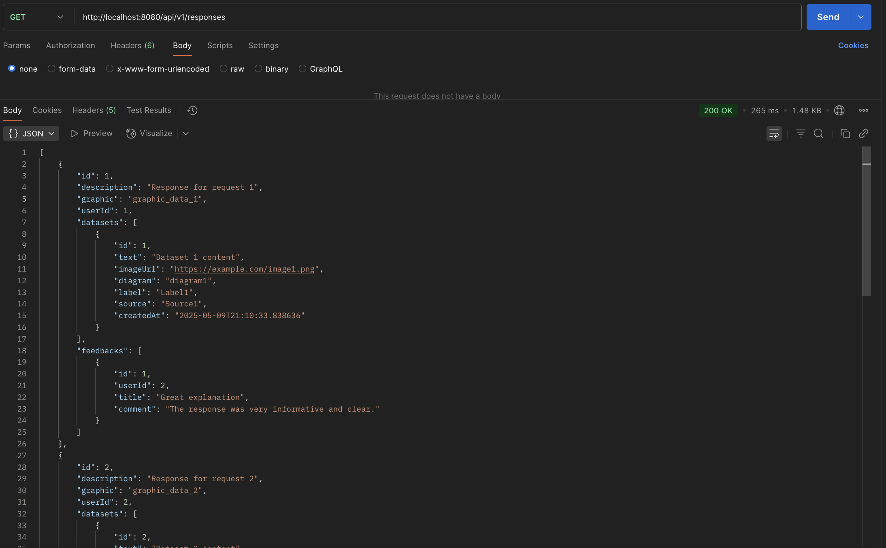

# Тестування працездатності системи

## Запуск тестування

переходимо в директориію src/api/db_lab_6 де вихідний код api

```bash
cd src/api/db_lab_6
```

перевіряємо, чи встановлено maven:

```bash
mvn --version
```

якщо ні, то встановлюємо maven на нашу ОС.
<br>
<br>

компілюємо та збираємо прооект

```bash
mvn clean package
```

запускаємо проект за допомогою java

```bash
cd target
java -jar db_lab_6-0.0.1-SNAPSHOT.jar
```

Або ж запускаємо за допомогою maven (перед цим не треба додатково збирати та запаковувати проект)
```bash
mvn spring-boot:run
```
<hr>

## Тестування

### Response:

#### GET All

#### GET By ID

#### POST

#### PUT

#### DELETE

<hr>

### Dataset:

#### GET All

#### GET By ID

#### POST

#### PUT

#### DELETE

<hr>

### Feedback:

#### GET All

#### GET By ID

#### POST

#### PUT

#### DELETE
