# Тестування працездатності системи
Збірку та тестування будемо проводити за допомогою Maven


## Збірка проекту

Із директорії ./src/api/db_lab_6 виконуємо команду для збірки проекту

```bash
mvn clean install
```

## Запуск тестування

Запускаємо додаток за допомогою команди

```bash
mvn spring-boot:run
```
<hr>

## Тестування

### User:

#### GET All
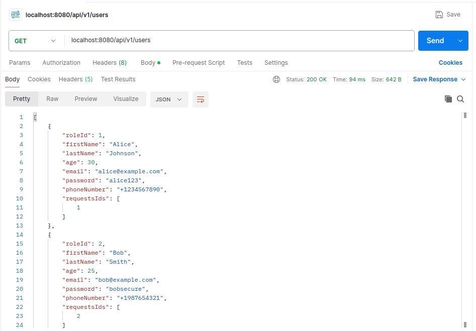
#### GET By ID
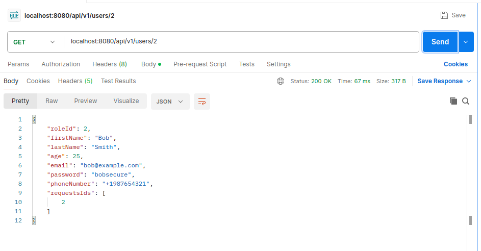
#### POST
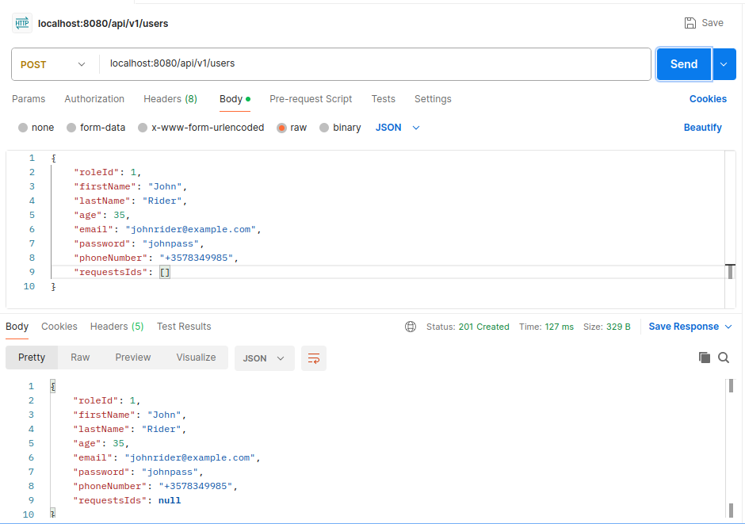
#### PUT
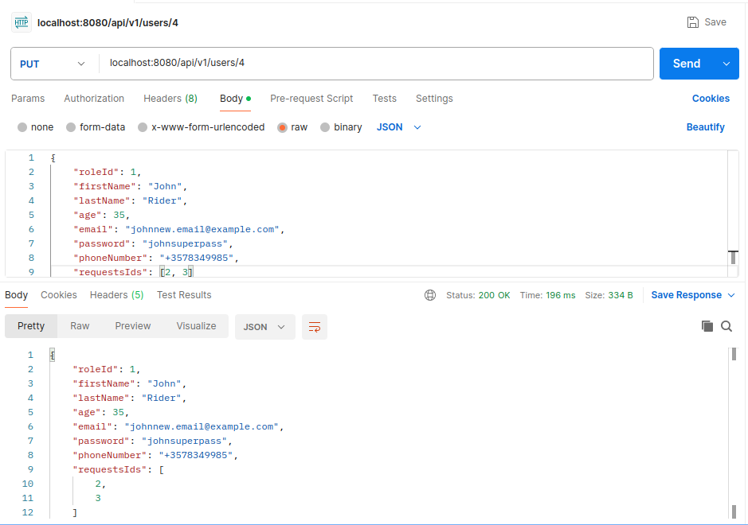
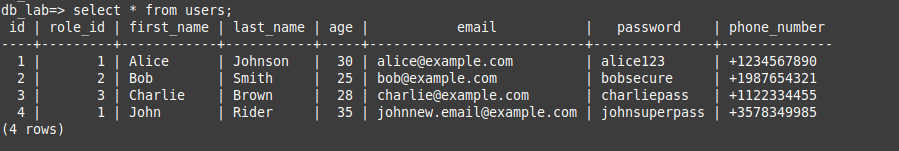
#### DELETE
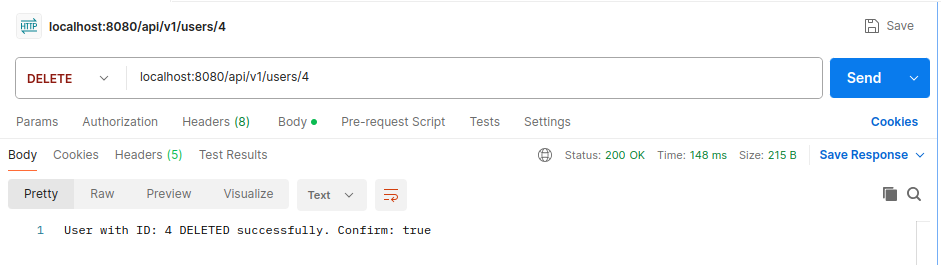

<hr>

### Request:

#### GET All
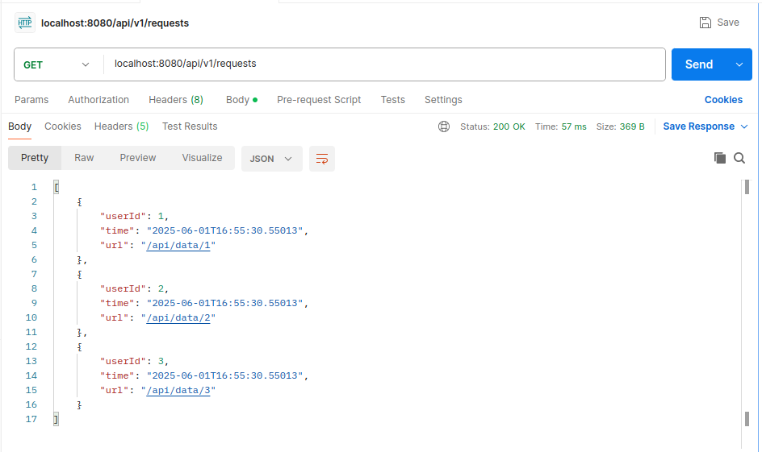
#### GET By ID
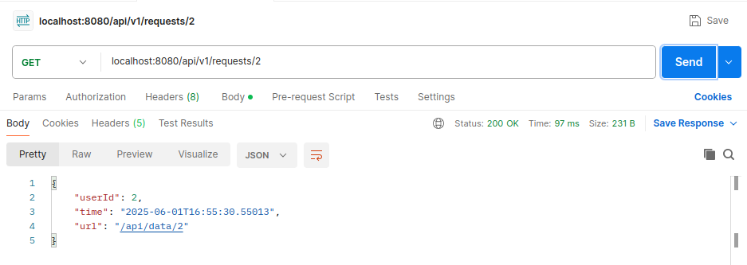
#### POST
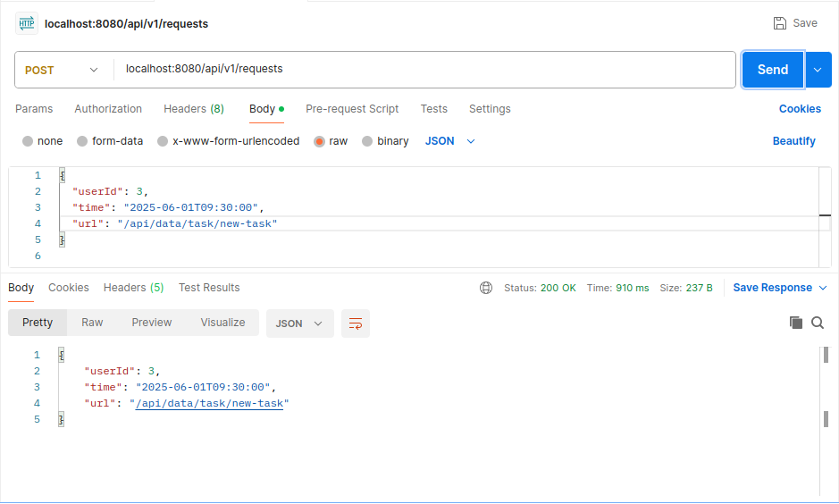

З таблиці requests виберемо всі записи. Бачимо, що новий запит з id=4 успішно доданий
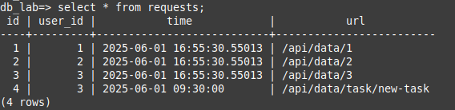

#### PUT
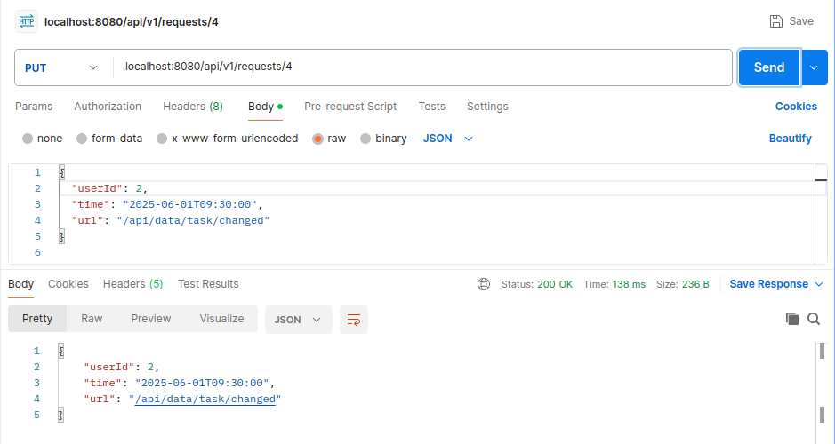

З таблиці requests виберемо всі записи. Бачимо, що запит з id=4 змінив user_id із 3 на 2 та вміст стовпця url був
замінений на /api/data/task/changed

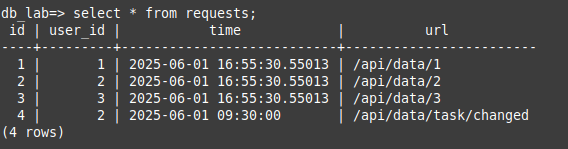

#### DELETE
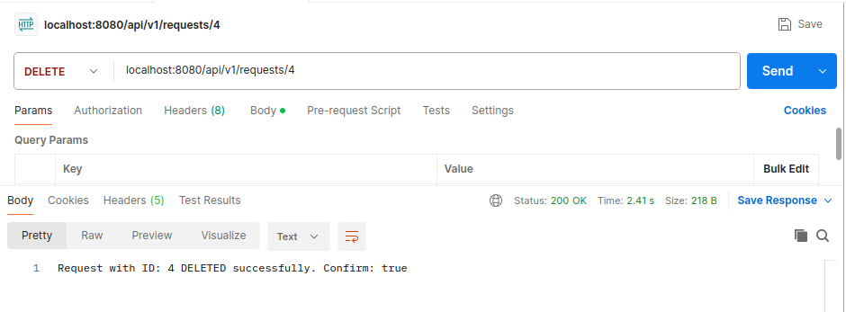
